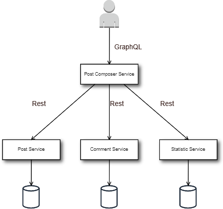

### Implementation of API composition pattern: https://microservices.io/patterns/data/api-composition.html



Service	| Address	
------------- | ------------------------- 
post-service	| http://localhost:8081/posts	
comment-service	| http://localhost:8082/comments
statistic-service	| http://localhost:8083/statistic
post-composer-service	| http://localhost:8080/graphiql

### How to perform query:
Go to the GraphQL UI http://localhost:8080/graphiql
```
query {
  post(id: 1)
  {
    id,
    username,
    text
    statistic {
      viewsNumber,
      clicksNumber,
      repostNumber
    },
    comments {
      id,
      username,
      text
    }
}
}
```